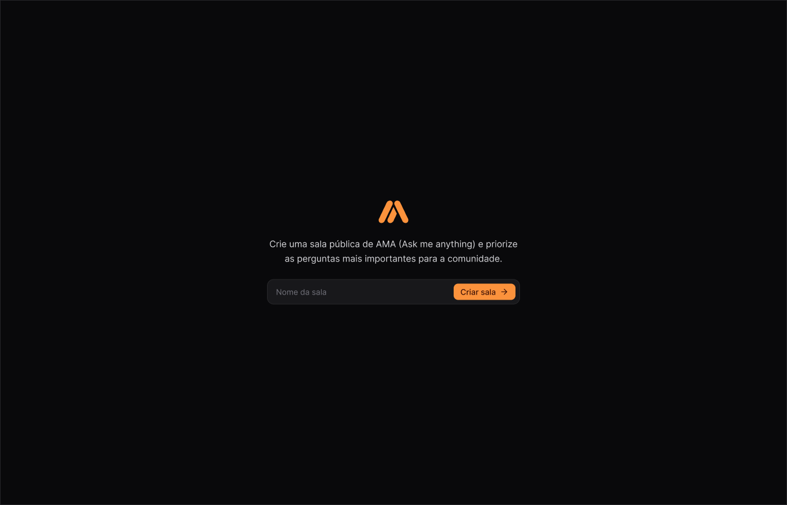
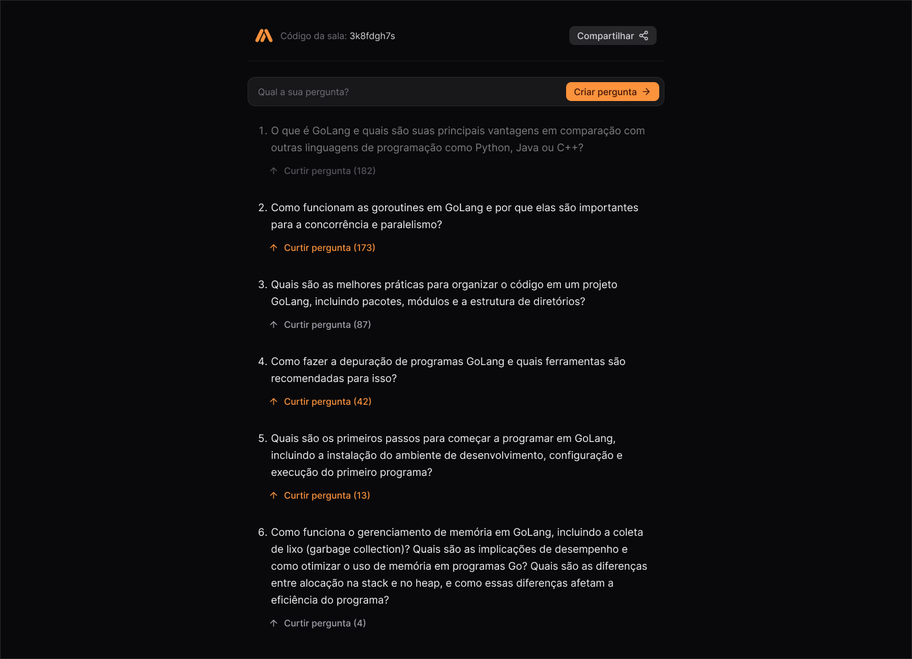

<!-- Improved compatibility of back to top link: See: https://github.com/othneildrew/Best-README-Template/pull/73 -->
<a id="readme-top"></a>
<!--
*** Thanks for checking out the Best-README-Template. If you have a suggestion
*** that would make this better, please fork the repo and create a pull request
*** or simply open an issue with the tag "enhancement".
*** Don't forget to give the project a star!
*** Thanks again! Now go create something AMAZING! :D
-->


<!-- PROJECT SHIELDS -->
<!--
*** I'm using markdown "reference style" links for readability.
*** Reference links are enclosed in brackets [ ] instead of parentheses ( ).
*** See the bottom of this document for the declaration of the reference variables
*** for contributors-url, forks-url, etc. This is an optional, concise syntax you may use.
*** https://www.markdownguide.org/basic-syntax/#reference-style-links
-->
<!-- [![Contributors][contributors-shield]][contributors-url]
[![Forks][forks-shield]][forks-url]
[![Stargazers][stars-shield]][stars-url]
[![Issues][issues-shield]][issues-url]
[![MIT License][license-shield]][license-url]
[![LinkedIn][linkedin-shield]][linkedin-url]
 -->


<!-- PROJECT LOGO -->
<br />
<div align="center">
  <a href="https://github.com/jonascesconetto/ask-me-anything">
    
  </a>

  <h3 align="center">Ask Me Anything</h3>

  <p align="center">
    Sitema aplicado para testar recuros de WebSokets utilizando as ferramentas Go e React.
  </p>
</div>

<!-- TABLE OF CONTENTS -->
<details>
  <summary>Table of Contents</summary>
  <ol>
    <li>
      <a href="#about-the-project">About The Project</a>
      <ul>
        <li><a href="#built-with">Built With</a></li>
      </ul>
    </li>
    <li>
      <a href="#getting-started">Getting Started</a>
      <ul>
        <li><a href="#prerequisites">Prerequisites</a></li>
        <li><a href="#installation">Installation</a></li>
      </ul>
    </li>
    <li><a href="#usage">Usage</a></li>
    <li><a href="#roadmap">Roadmap</a></li>
    <li><a href="#contributing">Contributing</a></li>
    <li><a href="#license">License</a></li>
    <li><a href="#contact">Contact</a></li>
    <li><a href="#acknowledgments">Acknowledgments</a></li>
  </ol>
</details>


<!-- ABOUT THE PROJECT -->
## Sobre o projeto

<a href="https://github.com/jonascesconetto/ask-me-anything">
    
</a>

<a href="https://github.com/jonascesconetto/ask-me-anything">
    
</a>

O Ask Me Anything (AMA) é um formato de evento muito popular, especialmente no mundo tecnológico, onde especialistas ou figuras públicas respondem a perguntas de uma audiência. Diante desta dinamica, o AMA, é uma ferramenta para criar fóruns de discussões. Abrindo salas especificas com a possibilidade de abrir perguntas dentro de uma determinada sala.

<p align="right">(<a href="#readme-top">back to top</a>)</p>


### Built With

This section should list any major frameworks/libraries used to bootstrap your project. Leave any add-ons/plugins for the acknowledgements section. Here are a few examples.

<!-- * [![Next][Next.js]][Next-url] -->
* [![React][React.js]][React-url]
* [![Go][Go.dev]][Go-url]
<!-- * [![Vue][Vue.js]][Vue-url]!!!!!!!!@@
* [![Angular][Angular.io]][Angular-url]
* [![Svelte][Svelte.dev]][Svelte-url]
* [![Laravel][Laravel.com]][Laravel-url]
* [![Bootstrap][Bootstrap.com]][Bootstrap-url]
* [![JQuery][JQuery.com]][JQuery-url] -->

<p align="right">(<a href="#readme-top">back to top</a>)</p>

<!-- GETTING STARTED -->
## Getting Started

Esta sessão oferece as instruções para configurar seu projeto localmente. Uma vez que você realizar o clone do repositório, siga as etapas listasd logo abaixo.

### Pré-requisitos

#### Instalando Go

A forma mais recomendada de obter o executável `go` utilizado para criar, executar e gerenciar projetos na linguagem é através do instalador oficial da linguagem ou do binário pré-compilado para seu sistema operacional.

Caso Você ja tenha a ferramenta `go` disponível no seu terminal, confira se a versão é >=1.21.

Isso pode ser feito rodando o comando:

```bash
go version
```

Caso a versão da sua ferramenta `go` seja menor que a versão 1.21, siga para a etapa de instalação de acordo com o site oficial da ferramenta `Go` https://go.dev/dl/.


### Configurando o VSCode para Go!

Manual de instalação do VSCode: https://code.visualstudio.com/docs/setup/setup-overview

Para a melhor experiência de desenvolvimento na linguagem recomendamos que você utilize as seguintes extensões do VSCode e siga o passo-a-passo abaixo:

1. Extensão oficial de Go: 

    Esta é a extensão oficial do Go para VSCode. Ela oferece funcionalidades como linting, auto-complete, debugging, formatação de código, gerenciamento de pacotes, entre outros. [Go - Visual Studio Marketplace](https://marketplace.visualstudio.com/items?itemName=golang.go)
        
2. Extensão Error Lens:
    
    Melhora a visibilidade de erros e avisos no código diretamente na linha correspondente dentro do editor, destacando-os de forma clara. [Error Lens - Visual Studio Marketplace](https://marketplace.visualstudio.com/items?itemName=usernamehw.errorlens)
        

Agora que as extensões principais estão instaladas, é hora de configurar a extensão Go para ativar todas as suas funcionalidades.

A extensão Go requer algumas ferramentas adicionais para funcionar corretamente. Para abrir o menu necessário, use o atalho `Ctrl+Shift+P` no Windows/Linux e `CMD+Shift+P` no macOS.

#### Instalando Docker e Docker Compose

A forma mais fácil e recomendada de obter o Docker é instalar o Docker Desktop. O Docker Desktop inclui o Docker Compose juntamente com o Docker Engine e Docker CLI, que são pré-requisitos do Compose.

O Docker Desktop está disponível em:

- [Linux](https://docs.docker.com/desktop/install/linux-install/)
- [Mac](https://docs.docker.com/desktop/install/mac-install/)
- [Windows](https://docs.docker.com/desktop/install/windows-install/)

Se você já instalou o Docker Desktop, pode verificar qual versão do Compose possui selecionando "Sobre o Docker Desktop" no menu do Docker, o menu do ícone da baleia.

Se você já tiver o Docker Engine e o Docker CLI instalados, pode instalar o plugin Compose a partir da linha de comando, de duas maneiras:

- [Usando o repositório do Docker](https://docs.docker.com/compose/install/linux/#install-using-the-repository)
- [Fazendo o download e instalação manualmente](https://docs.docker.com/compose/install/linux/#install-the-plugin-manually)

#### Instalando Node

Os criadores deste repositório sugerem a utilização do recurso `NVM`, um gerenciador de “instâncias” Node.js, ou seja, uma ferramenta que nos permite possuir múltiplas instalações do Node.js em nossa máquina. Abaxo segue um link com o passo a passo para instalação:

- [NVM Step by Step](https://fabiojanio.medium.com/nvm-gerencie-m%C3%BAltiplas-instala%C3%A7%C3%B5es-do-node-js-6fcd0f13aaf7)

### Instalando Yarn (Gerenciador de Pacotes)

Yarn é um gerenciador de pacotes para seu código. Ele permite que você use e compartilhe código (por exemplo, JavaScript) com outros desenvolvedores de todo o mundo. O Yarn faz isso de forma rápida, segura e confiável para que você nunca precise se preocupar. Abaixo segue link da documentação:

- [Yarnpkg.com](https://classic.yarnpkg.com/en/docs/install#windows-stable)

<!-- USAGE EXAMPLES -->
## Usage

Uma vez que os pré-requisitos foram atendidos, precisamos configurar os recursos para o uso da ferramenta.

### Back-end

- Docker
  - Banco de dados (PostgreSQL)
  - PGAdmin

Para subir os recurso do back-end, basta acessar o diretório `back-end`, e dentro do repositório executar o seguinte comando:

```bash
docker compose up
```

#### PGAdmin
- User: admin@admin.com
- Password: password

##### Configurar o Server no PGAdmin
- Hostname: db
- Port: 5434
- Database: wsrs
- Username: postgres
- Password: 123456789

#### Executando as Migrations

No terminal executar o seguinte comando: 

```bash
go run cmd/tools/terndotenv/main.go
``` 

#### Dependências adicionais

```bash
go get github.com/go-chi/cors
go get github.com/gorilla/websocket
```

#### Execuntado o serviço

Uma vez que as `migration`executarem sem nenhum erro no console, basta subir o serviço de back-end, por meio do seguinte comando abaixo:

```bash
go run cmd/wsrs/main.go
```

### Front-end
- React.js

#### Carregando as dependências

Para subir os recurso do front-end, basta acessar o diretório `front-end`, e dentro do repositório executar o seguinte comando:

```bash
yarn install
```

#### Criar o arquivo `.env`

Na raiz do diretório, criar o arquivo `.env` e incluir a seguinte informação:

```
VITE_APP_API_URL="http://localhost:8080/api"
```

#### Execuntado o serviço

Uma vez que as dependências e configurações do repositório sejam atendidas, basta executar o seguinte comando para subir o `fron-end`:

```bash
yarn dev
```

<!-- MARKDOWN LINKS & IMAGES -->
<!-- https://www.markdownguide.org/basic-syntax/#reference-style-links -->
[contributors-shield]: https://img.shields.io/github/contributors/othneildrew/Best-README-Template.svg?style=for-the-badge
[contributors-url]: https://github.com/othneildrew/Best-README-Template/graphs/contributors
[forks-shield]: https://img.shields.io/github/forks/othneildrew/Best-README-Template.svg?style=for-the-badge
[forks-url]: https://github.com/othneildrew/Best-README-Template/network/members
[stars-shield]: https://img.shields.io/github/stars/othneildrew/Best-README-Template.svg?style=for-the-badge
[stars-url]: https://github.com/othneildrew/Best-README-Template/stargazers
[issues-shield]: https://img.shields.io/github/issues/othneildrew/Best-README-Template.svg?style=for-the-badge
[issues-url]: https://github.com/othneildrew/Best-README-Template/issues
[license-shield]: https://img.shields.io/github/license/othneildrew/Best-README-Template.svg?style=for-the-badge
[license-url]: https://github.com/othneildrew/Best-README-Template/blob/master/LICENSE.txt
[linkedin-shield]: https://img.shields.io/badge/-LinkedIn-black.svg?style=for-the-badge&logo=linkedin&colorB=555
[linkedin-url]: https://linkedin.com/in/othneildrew
[product-screenshot]: images/screenshot.png
[Next.js]: https://img.shields.io/badge/next.js-000000?style=for-the-badge&logo=nextdotjs&logoColor=white
[Next-url]: https://nextjs.org/
[React.js]: https://img.shields.io/badge/React-20232A?style=for-the-badge&logo=react&logoColor=61DAFB
[React-url]: https://reactjs.org/
[Go.dev]: https://img.shields.io/badge/Go-20232A?style=for-the-badge&logo=go&logoColor=61DAFB
[Go-url]: https://go.dev/
[Vue.js]: https://img.shields.io/badge/Vue.js-35495E?style=for-the-badge&logo=vuedotjs&logoColor=4FC08D
[Vue-url]: https://vuejs.org/
[Angular.io]: https://img.shields.io/badge/Angular-DD0031?style=for-the-badge&logo=angular&logoColor=white
[Angular-url]: https://angular.io/
[Svelte.dev]: https://img.shields.io/badge/Svelte-4A4A55?style=for-the-badge&logo=svelte&logoColor=FF3E00
[Svelte-url]: https://svelte.dev/
[Laravel.com]: https://img.shields.io/badge/Laravel-FF2D20?style=for-the-badge&logo=laravel&logoColor=white
[Laravel-url]: https://laravel.com
[Bootstrap.com]: https://img.shields.io/badge/Bootstrap-563D7C?style=for-the-badge&logo=bootstrap&logoColor=white
[Bootstrap-url]: https://getbootstrap.com
[JQuery.com]: https://img.shields.io/badge/jQuery-0769AD?style=for-the-badge&logo=jquery&logoColor=white
[JQuery-url]: https://jquery.com 


